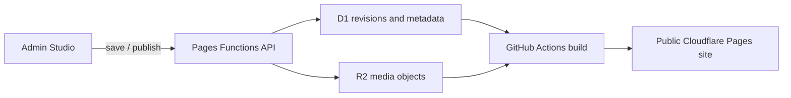
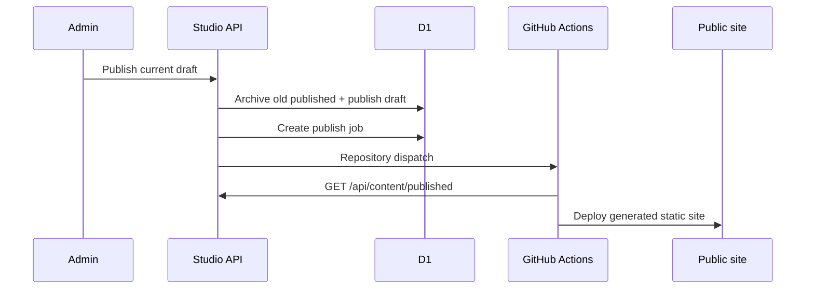

# Content flow

## מקור האמת

כל התוכן המובנה נשמר ב־Cloudflare D1 וכל המדיה נשמרת ב־Cloudflare R2. רק revision אחד יכול להיות במצב `published` בכל רגע.

## עריכת תוכן

ה־Studio מציג שישה אזורי תוכן: Hero, שירותים, גלריה, למה אנחנו, תהליך ויצירת קשר. כולם משתמשים בחוזה הטיפוסים המשותף ולא בקומפוננטות או מודלים כפולים.

- `GET /api/content/draft` טוען את טיוטת העבודה.
- `PUT /api/content/draft` שומר snapshot מלא עם optimistic concurrency.
- `GET /api/content/preview` מחזיר את התצוגה המקדימה.
- `POST /api/content/publish` מפרסם את הטיוטה ויוצר משימת deploy.
- `GET /api/content/history` מחזיר היסטוריית revisions.
- `POST /api/content/rollback` מפרסם עותק חדש של revision קודם.

כל endpoint שמשנה מצב דורש סשן אדמין תקין, בדיקת CSRF והרשאה שנקראת מ־D1.

## פרסום ובנייה

הפקודה `pnpm cloudflare:build:site` דורשת `CLOUDFLARE_CONTENT_API_ORIGIN`, מושכת את התוכן המפורסם, מסנכרנת את המדיה הנדרשת ובונה אתר סטטי. בנייה נכשלת אם אין revision מפורסם או אם תוכן/מדיה אינם תקינים.

## מדיה

מטא־דאטה נשמר ב־D1 והקובץ עצמו ב־R2. ה־API מחזיר כתובות מדיה יציבות, והבנייה מורידה רק נכסים שמופיעים ב־snapshot המפורסם. בדיקות checksum ו־MIME מונעות שימוש בקובץ פגום.

## זהות והרשאה

Google Identity מספק אסימון זהות בלבד עם `openid email profile`. השרת מאמת את האסימון ולאחר מכן בודק שהמייל פעיל בטבלת `admin_users`. הרשאות התוכן עצמן אינן מנוהלות אצל ספק הזהות.

## התאוששות

- rollback תמיד יוצר revision חדש ומפורסם ושומר את ההיסטוריה.
- D1 bookmarks וגיבוי ההגירה הראשוני מאפשרים שחזור במקרה חירום.
- משימות deploy נשמרות ב־D1 עם סטטוס, מספר ניסיונות ושגיאה אחרונה לצורך תחקור.

## שערי אימות

לפני מיזוג או פריסה מריצים `pnpm validate`. לאחר פריסה בודקים:

1. `/api/health` ו־`/api/content/published` מחזירים 200.
2. כניסת אדמין עובדת עם OAuth identity בלבד.
3. save, preview, publish ו־rollback עובדים ללא שגיאות.
4. האתר הציבורי מציג את revision שפורסם, וכל התמונות נטענות ללא 404.
