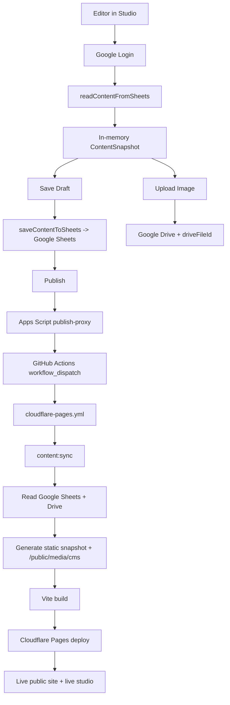

# Content Flow

מסמך זה הוא ה־source of truth התיעודי לזרימת התוכן בפרויקט `nis-boutique-catering`.

המטרה שלו היא לענות בצורה חד-משמעית על חמש שאלות:

1. מאיפה התוכן מגיע
2. איפה עורכים אותו
3. מה בדיוק נשמר בזמן טיוטה
4. מה בדיוק קורה בזמן פרסום
5. איך מוודאים שהאתר החי באמת רץ על התוכן החדש

## ארכיטקטורה בקצרה

הפרויקט בנוי משני יישומים וחבילה משותפת:

- `apps/admin/nis-content-studio`
  שכבת העריכה. קוראת וכותבת Google Sheets, מעלה תמונות ל־Google Drive, ומפעילה publish דרך Apps Script.
- `apps/frontend/nis-boutique-catering`
  האתר הציבורי. לא קורא את Google בזמן ריצה בדפדפן, אלא נבנה מ־snapshot סטטי בזמן build.
- `packages/content-schema`
  חוזה הנתונים המשותף בין הסטודיו, סקריפטי הסנכרון והאתר הציבורי.

## Source Of Truth

### ב־production

מקור האמת לתוכן מנוהל הוא:

- `Google Sheets` עבור תוכן מובנה
- `Google Drive` עבור קבצי מדיה מקוריים

### בריפו

הקבצים הבאים אינם מקור העריכה הראשי, אלא fallback / build artifacts / derived data:

- `apps/frontend/nis-boutique-catering/content/fallback-content.json`
- `apps/frontend/nis-boutique-catering/src/generated/siteContent.generated.json`
- `apps/frontend/nis-boutique-catering/src/generated/siteContent.generated.ts`
- `apps/frontend/nis-boutique-catering/public/media/cms`

כלל עבודה חשוב:

- אם הלקוח או הבעלים שינו תוכן דרך הסטודיו, האמת היא ב־Google Sheets/Drive.
- אם מפתח עובד בלי credentials מקומיים, ה־local יכול לרוץ על fallback ועדיין להיות "ירוק", בלי לשקף את ה־production.

## חוזה התוכן

החוזה המשותף מוגדר ב־[packages/content-schema/src/index.ts](/Users/evyatarhazan/Desktop/project/nis-boutique-catering/packages/content-schema/src/index.ts).

הישויות המרכזיות:

- `settings`
- `media`
- `gallery`
- `services`
- `sections`

ולכולן יש schema מאומת באמצעות `zod`.

משמעות תפעולית:

- הסטודיו קורא וכותב לפי אותו schema
- סקריפט הסנכרון ב־build מייצר snapshot לפי אותו schema
- האתר הציבורי צורך את אותו snapshot

כך נמנע פיצול לוגיקה בין "איך עורכים", "איך בונים", ו"איך מציגים".

## טבלאות Google Sheets

הטאבים המנוהלים כרגע הם:

- `site_settings`
- `media`
- `gallery`
- `services`
- `sections`

הקריאה והכתיבה שלהם מתבצעות מתוך:

- [apps/admin/nis-content-studio/src/googleApi.ts](/Users/evyatarhazan/Desktop/project/nis-boutique-catering/apps/admin/nis-content-studio/src/googleApi.ts)
- [apps/frontend/nis-boutique-catering/scripts/sync-content.mjs](/Users/evyatarhazan/Desktop/project/nis-boutique-catering/apps/frontend/nis-boutique-catering/scripts/sync-content.mjs)

המשמעות היא שהסטודיו ו־build-time sync משתמשים באותה חלוקה לוגית של התוכן.

## הזרימה המלאה

### 1. עריכת תוכן בסטודיו

כאשר עורך נכנס לסטודיו:

1. הסטודיו מבצע login מול Google Identity Services.
2. הסטודיו קורא את Google Sheets דרך `readContentFromSheets(accessToken)`.
3. הנתונים נטענים ל־`ContentSnapshot` בזיכרון של אפליקציית React.
4. כל שינוי UI מעדכן את ה־snapshot המקומי בלבד עד שמבצעים שמירה.

קבצים מרכזיים:

- [apps/admin/nis-content-studio/src/googleApi.ts](/Users/evyatarhazan/Desktop/project/nis-boutique-catering/apps/admin/nis-content-studio/src/googleApi.ts)
- [apps/admin/nis-content-studio/src/contentMutations.ts](/Users/evyatarhazan/Desktop/project/nis-boutique-catering/apps/admin/nis-content-studio/src/contentMutations.ts)
- [apps/admin/nis-content-studio/src/App.tsx](/Users/evyatarhazan/Desktop/project/nis-boutique-catering/apps/admin/nis-content-studio/src/App.tsx)

מה עדיין לא השתנה בשלב הזה:

- ה־Google Sheet לא השתנה
- ה־repo לא השתנה
- ה־site bundle החי לא השתנה
- Cloudflare לא נגע בשום דבר

### 2. שמירת טיוטה

כאשר לוחצים `שמור טיוטה`:

1. הסטודיו מאמת את ה־snapshot מול `contentSnapshotSchema`.
2. הוא כותב את כל הטאבים המנוהלים מחדש ל־Google Sheets דרך `saveContentToSheets`.
3. אם יש מדיה חדשה, היא כבר צריכה להיות ב־Drive ולהיות מקושרת דרך `driveFileId`.

קובץ מרכזי:

- [apps/admin/nis-content-studio/src/googleApi.ts](/Users/evyatarhazan/Desktop/project/nis-boutique-catering/apps/admin/nis-content-studio/src/googleApi.ts)

מה המשמעות:

- הטיוטה נשמרה במקור האמת
- עדיין לא קרה deploy
- האתר הציבורי החי עדיין לא השתנה

כלל חשוב:

- שמירת טיוטה היא content persistence בלבד
- שמירת טיוטה היא לא publish

### 3. העלאת מדיה

כאשר מעלים תמונה מהסטודיו:

1. הקובץ מועלה ל־Google Drive דרך `uploadImageToDrive`
2. הסטודיו שומר ב־`media` את `driveFileId`
3. בזמן publish/build הסקריפט בונה מזה נכס סטטי תחת `/media/cms`

קבצים מרכזיים:

- [apps/admin/nis-content-studio/src/googleApi.ts](/Users/evyatarhazan/Desktop/project/nis-boutique-catering/apps/admin/nis-content-studio/src/googleApi.ts)
- [apps/frontend/nis-boutique-catering/scripts/sync-content.mjs](/Users/evyatarhazan/Desktop/project/nis-boutique-catering/apps/frontend/nis-boutique-catering/scripts/sync-content.mjs)
- [apps/frontend/nis-boutique-catering/scripts/content-utils.mjs](/Users/evyatarhazan/Desktop/project/nis-boutique-catering/apps/frontend/nis-boutique-catering/scripts/content-utils.mjs)

עיקרון חשוב:

- ה־public site לא מגיש את קובץ Drive המקורי
- ה־build מוריד את המקור, ממיר אותו לנכסים סטטיים מותאמים, ורק אותם מגיש

### 4. פרסום

כאשר לוחצים `עדכן אתר`:

1. הסטודיו שומר קודם את הטיוטה ל־Google Sheets
2. הסטודיו קורא ל־publish endpoint דרך `triggerPublish(accessToken)`
3. ה־endpoint הוא Apps Script Web App
4. Apps Script מאמת את משתמש Google מול `userinfo`
5. Apps Script בודק שהמייל נמצא ב־`ALLOWED_EDITORS`
6. Apps Script מפעיל `workflow_dispatch` ל־GitHub Actions על `main`

קבצים מרכזיים:

- [apps/admin/nis-content-studio/src/googleApi.ts](/Users/evyatarhazan/Desktop/project/nis-boutique-catering/apps/admin/nis-content-studio/src/googleApi.ts)
- [tools/google-apps-script/publish-proxy.gs](/Users/evyatarhazan/Desktop/project/nis-boutique-catering/tools/google-apps-script/publish-proxy.gs)

המשמעות:

- הדפדפן לא דוחף קבצי תוכן ל־repo
- הדפדפן לא בונה את האתר
- הדפדפן רק שומר ב־Google ומבקש מהשרת/CI לבצע build ו־deploy

### 5. Build-time sync

במהלך ה־deploy workflow:

1. GitHub Actions מריץ `pnpm cloudflare:build:site`
2. הפקודה מריצה קודם `pnpm content:sync`
3. `sync-content.mjs` קורא את Google Sheets דרך service account
4. אם יש `driveFileId`, הסקריפט מוריד metadata וקובץ מקור מ־Google Drive
5. הוא מנרמל `src` לנתיב סטטי מסוג `/media/cms/<asset-id>.webp`
6. הוא מייצר נכסי מדיה סטטיים אופטימליים תחת `public/media/cms`
7. הוא כותב snapshot נגזר לתוך:
   - `src/generated/siteContent.generated.json`
   - `src/generated/siteContent.generated.ts`
8. לאחר מכן Vite בונה את האתר הציבורי על בסיס snapshot זה

קבצים מרכזיים:

- [package.json](/Users/evyatarhazan/Desktop/project/nis-boutique-catering/package.json)
- [apps/frontend/nis-boutique-catering/scripts/sync-content.mjs](/Users/evyatarhazan/Desktop/project/nis-boutique-catering/apps/frontend/nis-boutique-catering/scripts/sync-content.mjs)
- [apps/frontend/nis-boutique-catering/scripts/content-utils.mjs](/Users/evyatarhazan/Desktop/project/nis-boutique-catering/apps/frontend/nis-boutique-catering/scripts/content-utils.mjs)
- [apps/frontend/nis-boutique-catering/src/data/siteContent.ts](/Users/evyatarhazan/Desktop/project/nis-boutique-catering/apps/frontend/nis-boutique-catering/src/data/siteContent.ts)

### 6. Cloudflare Pages deploy

לאחר build מוצלח:

1. GitHub Actions בונה גם את האתר הציבורי וגם את הסטודיו
2. הוא מריץ deploy נפרד לכל פרויקט Cloudflare Pages
3. ה־production domains מצביעים לפרויקטים האלה

קובץ מרכזי:

- [/.github/workflows/cloudflare-pages.yml](/Users/evyatarhazan/Desktop/project/nis-boutique-catering/.github/workflows/cloudflare-pages.yml)

הדומיינים העיקריים:

- `https://nisboutiquecatering.com/`
- `https://studio.nisboutiquecatering.com/`

## Mermaid Flow

## Local Flow מול Production Flow

### Local ללא credentials

כאשר אין:

- `GOOGLE_SERVICE_ACCOUNT_JSON`
- `GOOGLE_SHEET_ID`

אז `content:sync` נופל חזרה ל־fallback:

- `content/fallback-content.json`

ומייצר ממנו snapshot נגזר.

זה אומר:

- ה־local יכול לעבוד
- ה־build יכול לעבור
- אבל ייתכן שהתוכן לא תואם ל־production

### Production

ב־production ה־workflow מגדיר:

- `CONTENT_SYNC_REQUIRE_REMOTE=true`

זה אומר:

- חייבים סנכרון אמיתי מול Google
- אם אין גישה ל־Google, ה־deploy נכשל
- לא אמור להיות מצב שבו production מפרסם fallback stale בשקט

קובץ מרכזי:

- [/.github/workflows/cloudflare-pages.yml](/Users/evyatarhazan/Desktop/project/nis-boutique-catering/.github/workflows/cloudflare-pages.yml)

## מה משנה את האתר החי

כדי לשנות את האתר החי באמת, כל השלבים הבאים חייבים להצליח:

1. הטיוטה נשמרה ל־Google Sheets
2. ה־publish trigger הופעל
3. `Deploy to Cloudflare Pages` עבר בהצלחה
4. `content:sync` השתמש בנתונים המרוחקים ולא ב־fallback
5. Cloudflare Pages העלה את build החדש
6. הדומיין החי מגיש את ה־bundle החדש

## מה לא משנה את האתר החי

הפעולות הבאות לבדן לא משנות production:

- שינוי טופס בסטודיו בלי שמירה
- שמירת טיוטה בלי publish
- שינוי קבצי fallback לוקאלית בלי deploy
- build מקומי מוצלח
- `HTTP 200` מדומיין חי של deployment ישן

## קבצים מרכזיים לפי שלב

| שלב | קבצים עיקריים |
|---|---|
| Schema | `packages/content-schema/src/index.ts` |
| Read/Write Studio | `apps/admin/nis-content-studio/src/googleApi.ts` |
| Studio state mutations | `apps/admin/nis-content-studio/src/contentMutations.ts` |
| Publish trigger | `apps/admin/nis-content-studio/src/googleApi.ts`, `tools/google-apps-script/publish-proxy.gs` |
| Build-time sync | `apps/frontend/nis-boutique-catering/scripts/sync-content.mjs` |
| Snapshot generation | `apps/frontend/nis-boutique-catering/scripts/content-utils.mjs` |
| Public site consumption | `apps/frontend/nis-boutique-catering/src/data/siteContent.ts` |
| CI | `.github/workflows/ci.yml` |
| Deploy | `.github/workflows/cloudflare-pages.yml` |
| Seed/reset | `.github/workflows/seed-google-content.yml`, `apps/frontend/nis-boutique-catering/scripts/seed-content.mjs` |

## Environment Variables

### Studio

- `VITE_GOOGLE_CLIENT_ID`
- `VITE_GOOGLE_API_KEY`
- `VITE_GOOGLE_SHEET_ID`
- `VITE_GOOGLE_DRIVE_FOLDER_ID`
- `VITE_GOOGLE_APPS_SCRIPT_PUBLISH_URL`
- `VITE_ALLOWED_EDITORS`

### Public site build

- `GOOGLE_SHEET_ID`
- `GOOGLE_SERVICE_ACCOUNT_JSON`
- `CONTENT_SYNC_REQUIRE_REMOTE`

## Failure Modes נפוצים

### 1. נשמרה טיוטה אבל האתר לא השתנה

כנראה:

- השמירה הצליחה
- אבל publish לא הופעל או deploy נכשל

בדיקה:

1. לוודא שהשינוי קיים ב־Google Sheets
2. לבדוק את run האחרון של `Deploy to Cloudflare Pages`

### 2. האתר עלה אבל עם תוכן ישן

כנראה:

- ה־deploy הצליח על deployment ישן
- או נבדק רק `HTTP 200`
- או local fallback בלבל את התמונה

בדיקה:

1. לבדוק שה־commit הרצוי הוא זה שעבר deploy
2. לבדוק version/siteVersion ב־bundle
3. לבדוק אם `content:sync` רץ על remote

### 3. תמונה קיימת בסטודיו אבל לא באתר

כנראה:

- יש `driveFileId` חסר או שגוי
- ה־build לא הצליח להוריד את הקובץ
- או שה־media item קיים אבל לא מקושר ל־gallery/service/section פעילים

בדיקה:

1. לבדוק את שורת `media`
2. לבדוק שימושים דרך `mediaId`
3. לבדוק את תוצרי `public/media/cms`

### 4. local נראה שונה מ־production

כנראה:

- local רץ על fallback
- production רץ על Google Sheets/Drive

בדיקה:

1. לבדוק אם קיימים credentials מקומיים
2. לבדוק מה `content:sync` הדפיס
3. להשוות `siteVersion`

## Verification Checklist

### שינוי תוכן רגיל

1. לערוך בסטודיו
2. לשמור טיוטה
3. לוודא שהערך אכן נשמר ב־Google Sheets
4. ללחוץ `עדכן אתר`
5. לוודא ש־GitHub Actions `Deploy to Cloudflare Pages` עבר
6. לפתוח את האתר החי
7. לוודא שהשינוי נראה בפועל

### שינוי מדיה

1. להעלות תמונה / לקשר `driveFileId`
2. לוודא שהשורה ב־`media` תקינה
3. לוודא שהמדיה מקושרת ל־gallery/service/section
4. לפרסם
5. לוודא שב־production נטען נכס תחת `/media/cms/...`

### בדיקת pipeline מלאה

1. `pnpm validate`
2. `pnpm cloudflare:build:site`
3. `gh run list --limit 5`
4. `gh run watch <run-id>`
5. `curl -I https://nisboutiquecatering.com/`
6. `curl -I https://studio.nisboutiquecatering.com/`

## תחזוקה שוטפת

צריך לעדכן את המסמך הזה כאשר אחד מהבאים משתנה:

- טאבים מנוהלים ב־Google Sheets
- schema של `ContentSnapshot`
- תהליך השמירה בסטודיו
- תהליך publish
- תהליך `content:sync`
- פרויקט Pages / דומיינים / workflow deploy

אם שינוי כזה בוצע בלי עדכון המסמך, התיעוד מפסיק להיות מקור אמת.
